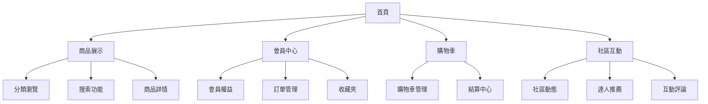
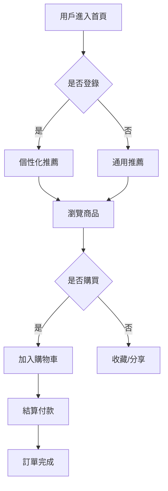
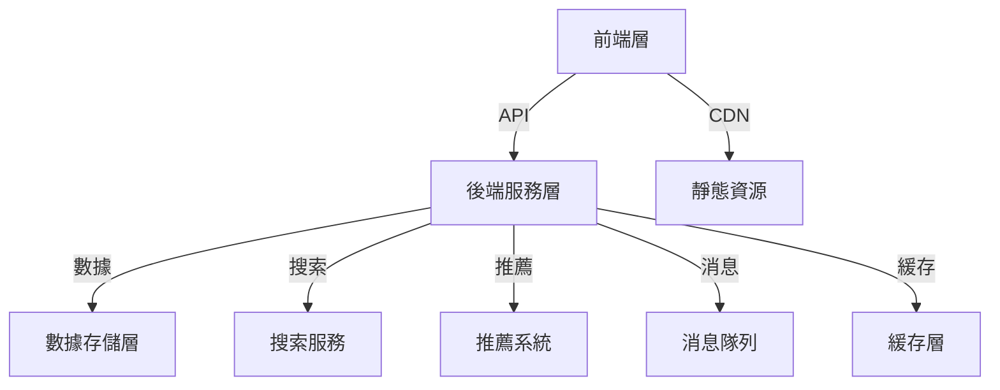

# 潮服3C官方商城產品需求文檔(PRD)

## 1. 文檔信息

### 1.1 版本歷史
- V1.0.0 (2024-01-20) 初始版本

### 1.2 文檔目的
本文檔旨在詳細描述潮服3C官方商城的產品定位、功能需求和技術實現方案，為設計、開發、測試等團隊提供明確的指導方針。

### 1.3 相關文檔引用
- 用戶故事地圖：docs/user_story_map.md
- 產品路線圖：docs/roadmap.md
- 指標框架：docs/metrics_framework.md

## 2. 產品概述

### 2.1 產品名稱與定位
- 產品名稱：TrendTech Mall (暫定)
- 定位：高端潮流服飾與精選3C產品的一站式購物平台

### 2.2 產品願景與使命
- 願景：打造年輕一代首選的潮流科技生活方式平台
- 使命：通過時尚與科技的完美融合，為用戶提供極致的購物體驗

### 2.3 價值主張與獨特賣點(UPS)
- 潮流與科技的跨界融合
- 高品質商品嚴選機制
- 個性化的購物體驗
- 會員專屬權益體系

### 2.4 目標平台列表
- Web端（PC響應式設計）
- iOS App
- Android App
- 微信小程序

### 2.5 產品核心假設
- 目標用戶群體對潮流服飾和高端3C產品有強烈需求
- 用戶願意為優質的購物體驗支付溢價
- 跨界整合能帶來更高的客單價和複購率

### 2.6 商業模式概述
- 自營+品牌入駐模式
- 會員訂閱制
- 跨品類捆綁銷售

## 3. 用戶研究

### 3.1 目標用戶畫像

#### 3.1.1 人口統計特徵
- 年齡：18-35歲
- 性別：男女不限
- 收入：月收入8000+
- 地區：一二線城市為主

#### 3.1.2 行為習慣與偏好
- 追求時尚，熱衷潮流文化
- 對科技產品有較強興趣
- 習慣線上購物
- 社交媒體活躍度高

#### 3.1.3 核心需求與痛點
- 需求：
  - 尋找獨特的穿搭風格
  - 購買優質的3C產品
  - 獲得專業的搭配建議
  - 享受便捷的購物體驗
- 痛點：
  - 難以找到風格與品質兼具的商品
  - 缺乏專業的穿搭建議
  - 擔心商品真實性
  - 售後服務體驗差

#### 3.1.4 動機與目標
- 提升個人形象
- 追求品質生活
- 展現個性魅力
- 獲得社交認同

### 3.2 用戶場景分析

#### 3.2.1 核心使用場景
1. 日常購物場景
   - 瀏覽新品上架
   - 搜索特定商品
   - 查看商品詳情
   - 進行支付結算

2. 會員服務場景
   - 會員註冊登錄
   - 查看會員權益
   - 參與會員活動
   - 獲取專屬優惠

3. 社交互動場景
   - 分享購物心得
   - 查看達人推薦
   - 參與社區討論
   - 獲取搭配建議

#### 3.2.2 邊緣使用場景
- 商品退換貨
- 客服諮詢
- 投訴處理
- 活動報名

## 4. 市場與競品分析

### 4.1 市場規模與增長預期
- 潮流服飾市場：年增長率20%
- 3C產品市場：年增長率15%
- 跨界零售市場：年增長率25%

### 4.2 行業趨勢分析
- 線上線下融合加速
- 個性化需求增強
- 社交電商崛起
- 品質消費升級

### 4.3 競爭格局分析

#### 4.3.1 直接競爭對手
1. Nike
   - 優勢：品牌力強、產品線完整
   - 劣勢：價格偏高、缺乏3C品類

2. Apple Store
   - 優勢：產品品質好、體驗佳
   - 劣勢：品類單一、價格昂貴

#### 4.3.2 間接競爭對手
- 傳統百貨商場
- 垂直電商平台
- 社交電商平台

### 4.4 競品功能對比矩陣
| 功能點 | 我們 | Nike | Apple Store |
|-------|------|------|-------------|
| 商品品類 | 全品類 | 服飾為主 | 3C為主 |
| 會員體系 | 多層級 | 單一層級 | 單一層級 |
| 社交功能 | 強 | 中 | 弱 |
| 個性化推薦 | 強 | 中 | 中 |

### 4.5 市場差異化策略
- 跨界整合優勢
- 強社交屬性
- 會員權益差異化
- 個性化服務

## 5. 產品功能需求

### 5.1 功能架構

### 5.2 核心功能詳述

#### 5.2.1 商品展示模塊

**功能描述**
作為用戶，我想要瀏覽和搜索商品，以便找到心儀的產品。

**用戶價值**
- 快速找到目標商品
- 了解商品詳細信息
- 獲得相關商品推薦

**功能邏輯與規則**
1. 商品分類
   - 一級分類：潮服、3C、配飾
   - 二級分類：具體品類
   - 三級分類：細分品類

2. 搜索功能
   - 關鍵詞搜索
   - 條件篩選
   - 排序方式

3. 商品詳情
   - 基本信息
   - 規格參數
   - 購買須知
   - 相關推薦

**交互需求**
- 支持列表/網格切換
- 支持無限滾動加載
- 支持快速篩選

**數據需求**
- 商品基本信息
- 庫存數據
- 銷售數據
- 用戶行為數據

#### 5.2.2 會員中心模塊

**功能描述**
作為會員，我想要管理個人賬戶並享受會員權益，以獲得更好的購物體驗。

**用戶價值**
- 享受會員專屬權益
- 管理個人信息和訂單
- 獲得個性化服務

**功能邏輯與規則**
1. 會員等級
   - 普通會員
   - 銀卡會員
   - 金卡會員
   - 黑卡會員

2. 權益體系
   - 積分獎勵
   - 專屬優惠
   - 生日特權
   - VIP服務

3. 個人中心
   - 基本信息管理
   - 收貨地址管理
   - 支付方式管理
   - 安全設置

**交互需求**
- 一鍵登錄
- 快速切換賬號
- 指紋/面部識別

**數據需求**
- 用戶基本信息
- 會員等級數據
- 權益使用記錄
- 安全認證信息

#### 5.2.3 社區互動模塊

**功能描述**
作為用戶，我想要參與社區互動，分享購物體驗，獲取穿搭建議。

**用戶價值**
- 獲得專業建議
- 分享個人經驗
- 參與社區互動

**功能邏輯與規則**
1. 內容發布
   - 圖文發布
   - 視頻發布
   - 評論互動

2. 達人認證
   - 認證標準
   - 權益機制
   - 內容審核

3. 互動機制
   - 點贊
   - 收藏
   - 分享
   - 關注

**交互需求**
- 流暢的發布體驗
- 即時的互動反饋
- 個性化的內容推薦

**數據需求**
- 用戶互動數據
- 內容數據
- 達人信息
- 推薦算法數據

## 6. 用戶流程與交互設計指導

### 6.1 核心流程

### 6.2 交互設計規範

#### 6.2.1 導航設計
- 底部固定導航欄（首頁、分類、購物車、我的）
- 頂部搜索欄
- 側邊快捷功能欄

#### 6.2.2 頁面布局
- 簡潔現代風格
- 重點內容突出
- 層級分明

#### 6.2.3 操作反饋
- 加載動效
- 操作提示
- 錯誤反饋

## 7. 非功能需求

### 7.1 性能指標
- 頁面加載時間 ≤ 2秒
- 圖片加載時間 ≤ 1秒
- 搜索響應時間 ≤ 0.5秒
- 支付響應時間 ≤ 3秒

### 7.2 安全需求
- 用戶數據加密存儲
- 支付安全保障
- 防刷機制
- 內容審核機制

### 7.3 可用性需求
- 系統可用性 ≥ 99.9%
- 故障恢復時間 ≤ 30分鐘
- 數據備份周期：每日

## 8. 技術架構考量

### 8.1 技術選型
- 前端：React + Next.js
- 後端：Spring Cloud
- 數據庫：MySQL + Redis
- 搜索：Elasticsearch
- 消息隊列：RabbitMQ

## 9. 驗收標準彙總

### 9.1 功能驗收標準
| 模塊 | 驗收項 | 標準 |
|------|--------|------|
| 商品展示 | 頁面加載 | ≤ 2秒 |
| 會員中心 | 註冊流程 | ≤ 3步 |
| 社區互動 | 內容發布 | ≤ 30秒 |

### 9.2 性能驗收標準
| 指標 | 標準 | 說明 |
|------|------|------|
| 併發用戶 | ≥ 10000 | 峰值時段 |
| 響應時間 | ≤ 1秒 | 90%請求 |
| 成功率 | ≥ 99.9% | 所有請求 |

## 10. 產品成功指標

### 10.1 業務指標
- DAU：≥ 100,000
- 月活用戶：≥ 1,000,000
- 轉化率：≥ 5%
- 客單價：≥ 1000元

### 10.2 用戶指標
- 用戶滿意度：≥ 4.5分（滿分5分）
- 複購率：≥ 30%
- 會員續費率：≥ 80%
- NPS：≥ 40

### 10.3 運營指標
- 商品上新率：每週 ≥ 100個
- 社區內容更新：每日 ≥ 50篇
- 活動參與率：≥ 20%
- 用戶增長率：月均 ≥ 10%