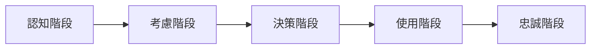

# TrendTech Mall 用戶故事地圖

## 一、用戶旅程階段

## 二、用戶故事分解

### 1. 認知階段

#### 核心故事
| 故事描述 | 優先級 | 驗收標準 |
|---------|--------|----------|
| 作為潮流愛好者，我想要了解最新的潮服和3C產品，以跟上潮流趨勢 | P0 | 首頁展示最新上架商品，更新頻率≤24小時 |
| 作為新用戶，我想要快速了解平台特色，以確定是否符合我的需求 | P0 | 首頁核心價值展示區域點擊率≥15% |
| 作為用戶，我想要便捷地找到感興趣的商品類別，以節省瀏覽時間 | P1 | 導航分類層級≤3層，找到目標商品時間≤30秒 |

#### 擴展故事
- 通過社交媒體了解平台
- 接收平台推廣信息
- 查看平台活動信息

### 2. 考慮階段

#### 核心故事
| 故事描述 | 優先級 | 驗收標準 |
|---------|--------|----------|
| 作為用戶，我想要詳細了解商品信息，以做出購買決策 | P0 | 商品詳情頁面停留時間≥1分鐘 |
| 作為用戶，我想要查看其他用戶的評價，以確認商品品質 | P0 | 評價內容展示率100%，好評率≥95% |
| 作為用戶，我想要比較不同商品，以選擇最適合的產品 | P1 | 支持同類商品對比，對比轉化率≥20% |

#### 擴展故事
- 收藏感興趣的商品
- 諮詢客服了解詳情
- 查看搭配推薦

### 3. 決策階段

#### 核心故事
| 故事描述 | 優先級 | 驗收標準 |
|---------|--------|----------|
| 作為用戶，我想要便捷地完成支付，以快速獲得商品 | P0 | 支付流程≤3步，支付成功率≥99.9% |
| 作為用戶，我想要選擇合適的配送方式，以滿足收貨需求 | P0 | 提供至少3種配送方式，配送滿意度≥95% |
| 作為用戶，我想要使用優惠券，以節省購物成本 | P1 | 優惠券使用率≥30%，優惠轉化率≥40% |

#### 擴展故事
- 加入購物車
- 選擇支付方式
- 填寫收貨信息

### 4. 使用階段

#### 核心故事
| 故事描述 | 優先級 | 驗收標準 |
|---------|--------|----------|
| 作為用戶，我想要追蹤訂單狀態，以了解商品物流進度 | P0 | 物流信息更新頻率≤4小時，準確率100% |
| 作為用戶，我想要方便地進行退換貨，以保障購物權益 | P0 | 退換貨申請響應時間≤12小時，處理滿意度≥90% |
| 作為用戶，我想要分享使用體驗，以幫助其他用戶 | P1 | 評價完成率≥60%，有效評價率≥80% |

#### 擴展故事
- 聯繫售後服務
- 申請售後維修
- 參與商品討論

### 5. 忠誠階段

#### 核心故事
| 故事描述 | 優先級 | 驗收標準 |
|---------|--------|----------|
| 作為會員，我想要享受專屬權益，以提升購物體驗 | P0 | 會員權益使用率≥50%，會員滿意度≥4.5分 |
| 作為忠實用戶，我想要參與平台活動，以獲得更多優惠 | P0 | 活動參與率≥40%，活動轉化率≥25% |
| 作為達人用戶，我想要分享個人穿搭，以獲得社交認同 | P1 | 內容發布量≥1000/日，互動率≥15% |

#### 擴展故事
- 推薦新用戶註冊
- 參與會員活動
- 享受生日特權

## 三、優先級說明

### P0（必須實現）
- 對產品核心功能至關重要
- 影響用戶基本使用體驗
- 涉及系統穩定性和安全性

### P1（重要）
- 提升用戶體驗的重要功能
- 影響用戶留存和轉化
- 具有較高的商業價值

### P2（待定）
- 錦上添花的功能
- 可以後期迭代的功能
- 需要進一步驗證的功能

## 四、驗收標準說明

### 功能維度
- 功能完整性：功能實現是否完整
- 可用性：功能是否易於使用
- 穩定性：功能是否穩定運行

### 性能維度
- 響應時間：功能響應速度
- 並發能力：同時處理請求能力
- 資源佔用：系統資源使用情況

### 體驗維度
- 用戶滿意度：用戶使用評價
- 功能發現度：功能是否容易被發現
- 學習成本：功能是否容易上手

## 五、迭代策略

### 第一迭代（MVP）
- 核心購物流程
- 基礎會員系統
- 商品管理系統

### 第二迭代
- 社區功能
- 達人系統
- 活動營銷

### 第三迭代
- 個性化推薦
- 直播功能
- 跨境購物

## 六、風險評估

### 技術風險
- 系統穩定性
- 數據安全性
- 性能瓶頸

### 業務風險
- 用戶接受度
- 競品模仿
- 運營成本

### 應對策略
- 充分的測試和監控
- 快速響應機制
- 持續優化改進